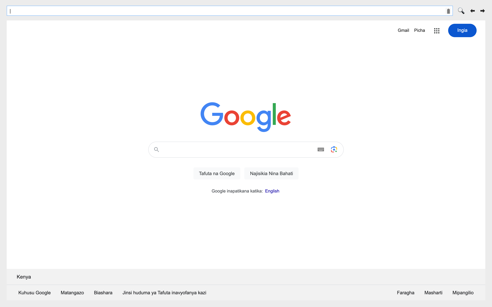

# Chahan Browser

Chahan Browser is a simple web browser application built using PyQt5 and QtWebEngineView. It allows users to browse the web, navigate pages using back and forward buttons, and search URLs directly from the interface.



## Features

- **Navigation Controls**: Navigate web pages using back (`⬅️`) and forward (`➡️`) buttons.
- **URL Entry**: Enter URLs directly into the URL bar (`QTextEdit`) and search (`🔍`) to load pages.
- **Developer Tools**: Integrated developer tools for inspecting and debugging web pages.

## Requirements

- Python 3.x
- PyQt5
- PyQtWebEngine

## Installation

1. Clone the repository:
   ```bash
   git clone https://github.com/yourusername/chahan-browser.git
   ```
2. Install dependencies:
   ```
   pip install PyQt5 PyQtWebEngine
   ```

## Usage

1. Run the File:
   ```
    python main.py
   ```
